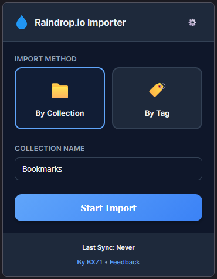
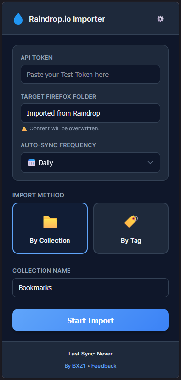

# Raindrop.io Importer for Firefox

  

**Bring your Raindrop.io bookmarks/collections directly into your native Firefox Bookmarks Toolbar.**  
Raindrop.io Importer is a specialized Firefox extension that bridges the gap between your cloud bookmarks and your native browser experience.

---

## 🖼️ Screenshots

  
  

---

## Why this extension? 🚀

Most bookmark managers keep your links tucked away in a separate app. This extension puts them exactly where you need them: **the native Firefox Bookmarks Toolbar.**

*   **Native & Fast**: Access your links using the browser's built-in toolbar, just like native bookmarks.
*   **Set and Forget**: Scheduled **Auto-Sync** keeps your toolbar fresh daily, every 3 days, or weekly.
*   **Offline Safety**: Won't touch your bookmarks if the API is down or you're offline.
*   **Designed for Firefox**: Purpose-built for the Firefox ecosystem.

## Installation 📦

You can install the official extension directly from the **[Firefox Add-ons Store](https://addons.mozilla.org/en-US/firefox/addon/raindrop-importer/)**.

## How to use ⚙️

1.  **Get your Token**: Generate a "Test Token" in your [Raindrop.io Settings](https://app.raindrop.io/settings/integrations).
2.  **Pick your Source**: Select a specific **Collection** or **#tag** to import.
3.  **Set the Target**: Choose which folder in your **Bookmarks Toolbar** should hold the synced links (Default: `Imported from Raindrop`).
4.  **Schedule Sync**: Choose your frequency and let the background script do the work.

## Development 🛠️

To load the extension for development:
1.  Clone this repository.
2.  Open Firefox and go to `about:debugging`.
3.  Click **"This Firefox"** -> **"Load Temporary Add-on..."**.
4.  Select `manifest.json`.

## License 📄

This project is licensed under the MIT License - see the [LICENSE](LICENSE) file for details.

*Not affiliated with Raindrop.io. Built for the community.*
